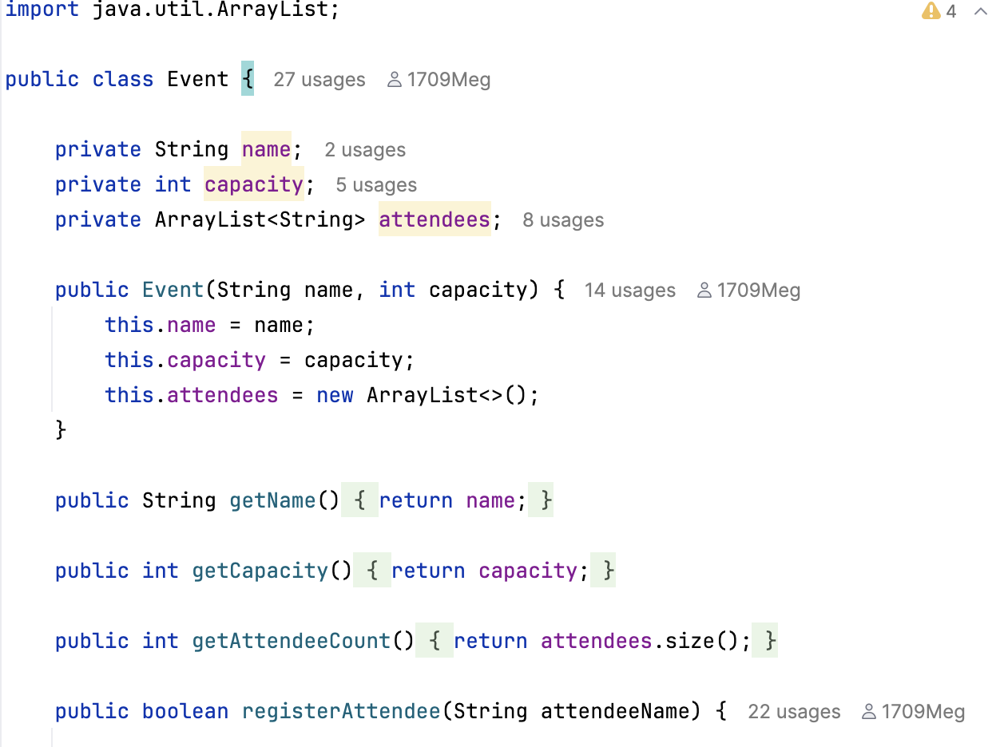
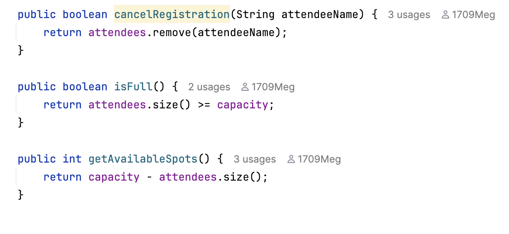
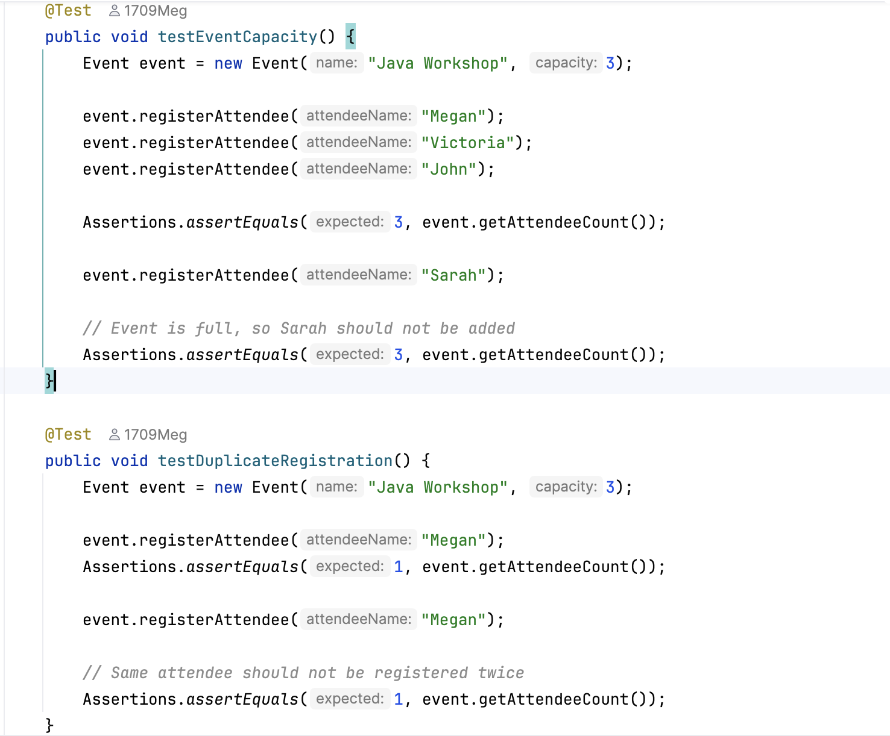
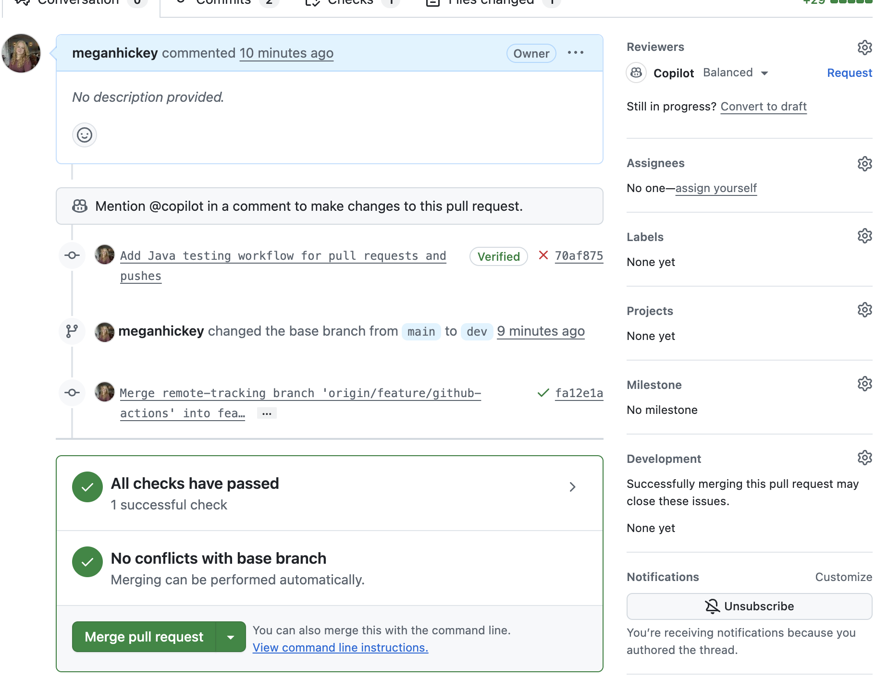

# Event Booking System

A Java application developed for the **SDAT & DevOps Combined QAP 1** at Keyin College. This project demonstrates object-oriented programming, unit testing, clean code practices, Git branching, and continuous integration.

## Features

- Create an event with a name and maximum capacity.
- Register attendees and cancel registrations.
- Prevent duplicate registrations and overbooking.
- View registered attendee counts and available spots.
- Check whether an event is full.

The `Event` class handles registration and capacity rules, while `Main.java` demonstrates the application.

## Technologies Used

- Java 21
- Maven
- JUnit 5
- Git and GitHub
- GitHub Actions
- IntelliJ IDEA

No application framework was used.

## Project Structure

```text
src/
├── main/java/
│   ├── Event.java
│   └── Main.java
└── test/java/
    └── EventTest.java

.github/workflows/tests.yml
docs/images/
pom.xml
README.md
```

## Running the Project

Open the project in IntelliJ IDEA and run `Main.java`.

Example output:

```text
Event: Java Workshop
Capacity: 3
Registered attendees: 2
Available spots: 1
Attendees after cancellation: 1
```

To run the unit tests, open `EventTest.java` in IntelliJ and run the test class, or use **Maven Lifecycle → test**.

## Unit Testing

JUnit 5 is used to test the application's functionality and business rules. All **12 unit tests passed**, covering both positive and negative scenarios.

| Test | What It Checks |
|---|---|
| Event creation | Correct name and capacity |
| Register attendee | Successful registration |
| Event capacity | Prevents overbooking |
| Duplicate registration | Prevents duplicate registrations |
| Cancel registration | Removes an existing attendee |
| Cancel unregistered attendee | Handles an attendee who is not registered |
| Event is full | Returns true when full |
| Event is not full | Returns false when space remains |
| Available spots | Calculates remaining spots |
| Available spots when full | Returns zero |
| Successful registration | Returns true |
| Registration when full | Returns false |

The tests use `assertEquals()`, `assertTrue()`, and `assertFalse()`.

## Clean Code Practices

**1. Meaningful Names and Encapsulation**

Descriptive names such as `registerAttendee()` and `getAvailableSpots()` make the code easier to understand. Private fields protect event data from direct modification.



**2. Small, Focused Methods**

Registration, cancellation, and capacity calculations are handled by separate methods. This keeps the code organized and easier to maintain.



**3. Readable Unit Tests**

Descriptive test names and clear assertions make it easier to understand which business rules are being tested.



## Git Workflow

The project follows a **dev/trunk-based workflow**:

`Feature branches → dev → main`

Feature branches used:

- `feature/project-setup`
- `feature/event-model`
- `feature/unit-tests`
- `feature/github-actions`
- `feature/documentation`

Each feature branch is merged into `dev` through a pull request. The completed development branch is then merged into `main` through a final pull request.

The `main` branch has protection rules requiring pull requests, restricting deletion, and blocking force pushes.

## GitHub Actions

GitHub Actions automatically runs the Java unit tests on pull requests and pushes to the `dev` and `main` branches.

The workflow is stored in `.github/workflows/tests.yml` and uses Java 21 with Maven to build and test the project.

The automated checks passed successfully after resolving an initial branch configuration issue.



## Dependencies and References

**JUnit Jupiter 5.11.0** is included as a test dependency in `pom.xml`. Maven manages the project's dependencies and build process.

References:

- [JUnit Documentation](https://docs.junit.org/5.11.0/user-guide/)
- [Maven Documentation](https://maven.apache.org/guides/)
- [GitHub Actions Documentation](https://docs.github.com/en/actions)
- Course examples and class material

## Challenges Encountered

- **JUnit dependency:** IntelliJ initially did not recognize JUnit until the Maven project was reloaded.
- **GitHub Actions:** The workflow initially failed because the branch did not contain `pom.xml`. After correcting the branch setup, the automated tests passed.

## Future Improvements

Possible improvements include supporting multiple events, adding event dates and locations, and saving registrations to a database.

## Author

**Megan Hickey**  
Software Development — Keyin College
